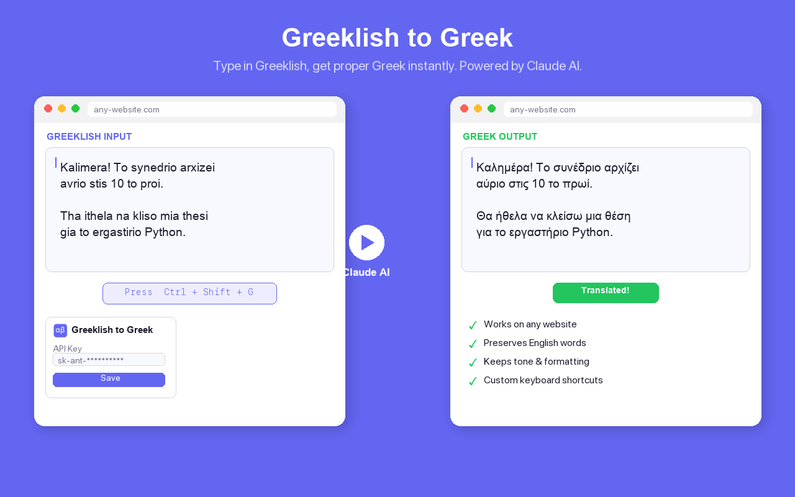

# Greeklish to Greek

A Chrome extension that instantly converts Greeklish (Greek written with Latin characters) to proper Greek text, right where you type. Powered by Claude AI.

## How it works

1. Type Greeklish in any text field
2. Press `Ctrl+Shift+G` (or your custom shortcut)
3. Your text is instantly replaced with proper Greek

### Examples

| Greeklish | Greek |
|-----------|-------|
| Kalimera! To synedrio arxizei avrio | Καλημέρα! Το συνέδριο αρχίζει αύριο |
| Tha ithela na kliso mia thesi | Θα ήθελα να κλείσω μια θέση |
| to ergastirio Python arxizei stis 3 | το εργαστήριο Python αρχίζει στις 3 |

## Features

- Works on any website in any text field, textarea, or contenteditable element
- Handles selected text or the entire field
- Preserves English words, punctuation, emojis, and formatting
- Keeps text that's already in Greek unchanged
- Maintains the casual or formal tone of your original text
- Customizable keyboard shortcut
- Automatic clipboard fallback for complex editors

## Setup

1. Install the extension from the Chrome Web Store
2. Click the extension icon and enter your [Anthropic API key](https://console.anthropic.com/)
3. Click Save
4. Start typing Greeklish anywhere and press `Ctrl+Shift+G`

> Your API key is stored locally in your browser and is never shared with third parties. Translation costs are minimal (fractions of a cent per request using Claude Haiku).

## Privacy

- Text is sent to the Anthropic API only when you trigger a translation
- API key is stored locally in Chrome storage
- No analytics, no tracking, no data collection
- See the full [Privacy Policy](privacy-policy.html)

## License

MIT
